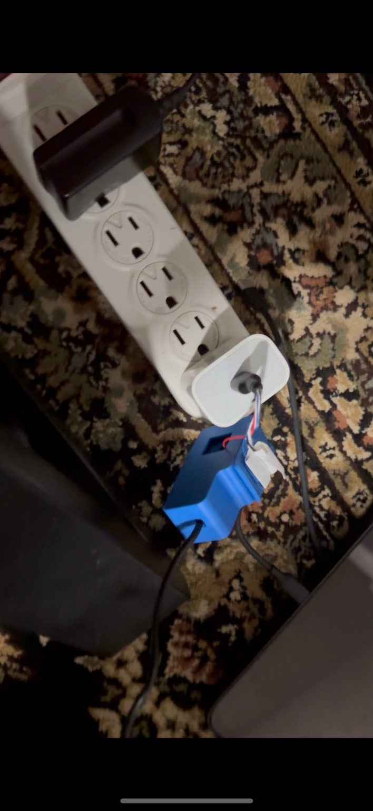
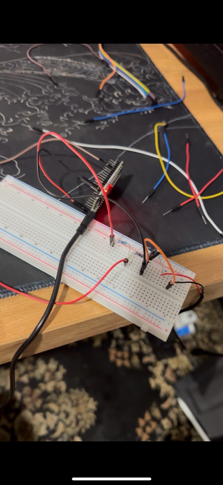
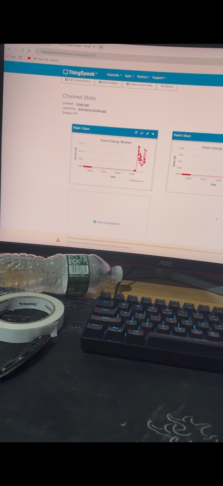
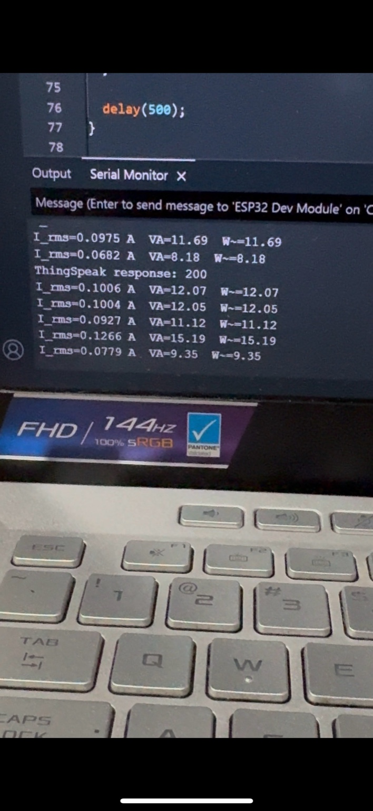

# Home Energy Dashboard

ESP32-powered smart energy monitor with cloud logging to ThingSpeak.

---

## Overview
This project demonstrates how to measure household energy consumption using an ESP32 microcontroller and visualize the results in the cloud.  
The project was built in **two phases**:

1. **Simulation Phase**  
   - Used a potentiometer and Python script to simulate current data.  
   - Verified ThingSpeak API integration and dashboard updates.  
   - Files: `esp32_simulated_logger.ino`, `simulate_energy_data.py`.

2. **Real Hardware Phase**  
   - Connected an SCT-013 CT sensor to the ESP32 to measure actual current.  
   - Sent live data to ThingSpeak for visualization.  
   - Breadboard prototype tested with phone charger load.  
   - Files: `esp32_real_logger.ino`.

---

## Features
- Real-time current measurement with CT sensor.  
- ESP32 Wi-Fi connection for IoT data logging.  
- Cloud dashboard via ThingSpeak.  
- Breadboard prototype tested with a real load.  

---

## Theory

So far this project only measures current with the CT sensor. Once I add a safe way to measure voltage, I’ll be able to calculate more useful numbers about energy use:

- **Apparent Power (VA)**  
  This is just voltage × current.  
  It’s the total power flowing, but not all of it is actually used.

- **Real Power (W)**  
  This is the actual power the device uses to do work (like charging, heating, lighting).  
  Real power depends on both voltage, current, and how much they are “in sync.”

- **Power Factor (PF)**  
  This tells you how efficient the power use is.  
  - PF = 1 → all the power is useful (resistive loads like heaters).  
  - PF < 1 → some power is wasted or just goes back and forth (motors, chargers, etc.).

### Quick Example  
If voltage is 120 V and current is 2 A:  
- Apparent Power = 240 VA  
- If the load is not perfect, Real Power might be ~208 W  
- Power Factor = 208 ÷ 240 = 0.87 → about 87% efficient  

Later, when I add voltage measurement, the dashboard will not just show current but also **real power, apparent power, and power factor**. That makes it closer to a real smart energy monitor.

---

## Hardware
- ESP32-CAM-MB Development Board  
- SCT-013 CT Sensor  
- Resistors, jumper wires, breadboard  
- Phone charger as test load  

---

## Project Gallery

**Load charging with CT sensor**  

**Breadboard prototype connected to ESP32**  

**ThingSpeak Dashboard**  

**Serial Monitor Output**  

---

## Next Steps
Currently, the dashboard only monitors current because working directly with mains AC voltage is unsafe without proper isolation.  

The next stage of the project will include **safe real voltage measurement**, using an **isolated AC voltage sensor (ZMPT101B)** or a **small step-down transformer**. This will enable:  
- Measuring both current and voltage simultaneously.  
- Calculating **real power (W)**, **apparent power (VA)**, and **power factor (PF)**.  
- A more accurate picture of energy usage.  

---

## Roadmap
- [x] Simulate current readings with potentiometer + Python.  
- [x] Add real CT sensor measurement with ESP32.  
- [ ] Add isolated AC voltage measurement (ZMPT101B or transformer).  
- [ ] Compute real power, apparent power, and power factor.  
- [ ] Design and fabricate a custom PCB for cleaner integration. 

---
